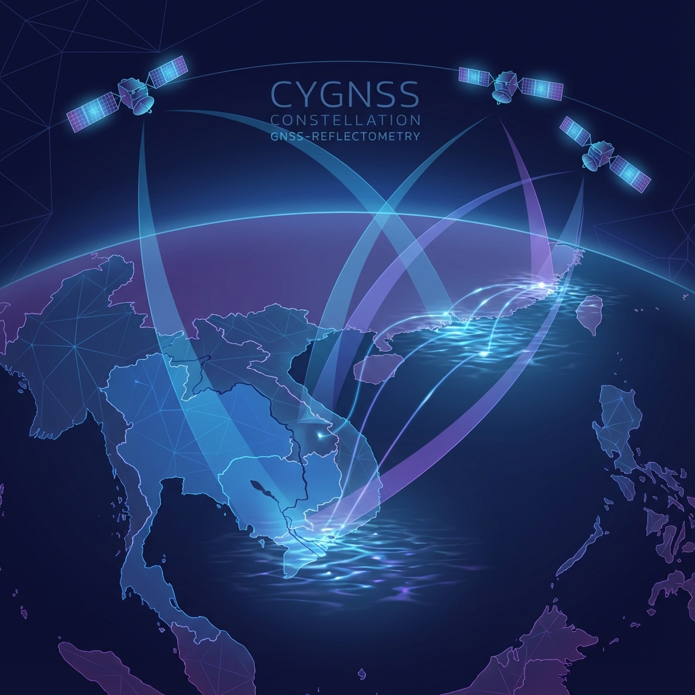
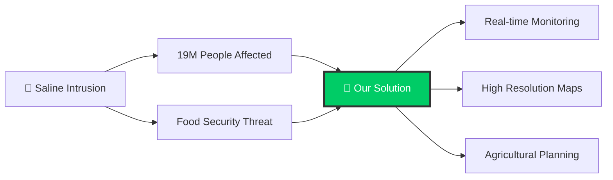
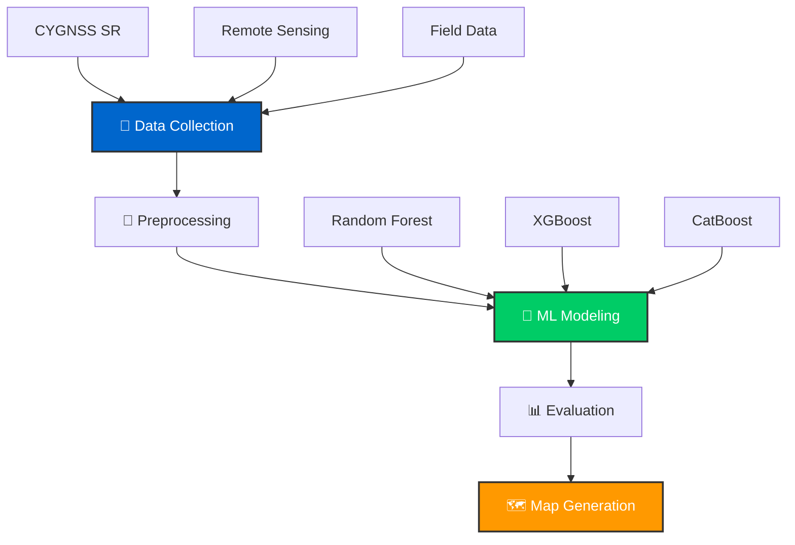
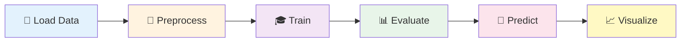

<div align="center">

<!-- Animated Header -->


<h3>
  
</h3>

<br>

<!-- Badges with Animation -->
<p>
  <a href="https://github.com/quanguet0409/SalinityCygnss">
    
  </a>
  <a href="https://github.com/quanguet0409/SalinityCygnss">
    
  </a>
  <a href="https://www.python.org/">
    
  </a>
  <a href="LICENSE">
    
  </a>
</p>

<br>

<!-- Navigation with Emojis -->
<p>
  <a href="#-introduction"><kbd> <br> 📌 Introduction <br> </kbd></a>
  <a href="#-demo-app"><kbd> <br> 🌐 Demo App <br> </kbd></a>
  <a href="#-methodology"><kbd> <br> 🔄 Methodology <br> </kbd></a>
  <a href="#-installation"><kbd> <br> 🚀 Installation <br> </kbd></a>
  <a href="#-usage"><kbd> <br> 💻 Usage <br> </kbd></a>
  <a href="#-models"><kbd> <br> 🤖 Models <br> </kbd></a>
  <a href="#-results"><kbd> <br> 📊 Results <br> </kbd></a>
  <a href="#-data-sources"><kbd> <br> 📚 Data Sources <br> </kbd></a>
</p>

<br>

<!-- Language Switcher with Flags -->
<p>
  <a href="README.en.md">
    
  </a>
  <a href="README.md">
    
  </a>
</p>

</div>

<br>

<!-- Divider -->


<br>

## 📌 Introduction

<div align="center">
  
  <p><i>CYGNSS satellite constellation for Earth observation</i></p>
</div>

<br>

**SalinityCygnss** leverages **CYGNSS (Cyclone Global Navigation Satellite System)** data - GNSS-Reflectometry technology combined with advanced **Machine Learning** algorithms to map and predict saline intrusion in the Mekong Delta.

<br>

<table align="center">
<tr>
<td align="center" width="25%">
  <br>
  <b>Mekong Delta 2025</b><br>
  <sub>Comprehensive study<br>(5 months: 1-5/2025)</sub>
</td>
<td align="center" width="25%">
  <br>
  <b>Tra Vinh 2024</b><br>
  <sub>Regional analysis</sub>
</td>
<td align="center" width="25%">
  <br>
  <b>Ben Tre 2020</b><br>
  <sub>Comparative data</sub>
</td>
<td align="center" width="25%">
  <br>
  <b>Bac Lieu 2019</b><br>
  <sub>Baseline</sub>
</td>
</tr>
</table>

<br>

### 🎯 Research Significance

<div align="center">



</div>

> 💡 Saline intrusion is one of the biggest challenges in the Mekong Delta, directly affecting **19 million people** and the nation's food security.

**This research provides:**

<div align="center">

| Feature | Description |
|:-------:|:------------|
| 💰 **Cost-Effective** | Low-cost monitoring solution using satellite data |
| 📡 **Real-Time** | Up-to-date salinity maps for decision making |
| 🎯 **High Precision** | 30m spatial resolution for detailed analysis |
| 🌾 **Agricultural Support** | Planning tools for farmers and policymakers |

</div>

<br>


<br>

## 🌐 Demo App

<div align="center">

### 🚀 Try It Now


<br><br>

**View interactive saline intrusion maps on Google Earth Engine**

<br>

<a href="https://ee-hanoi688.projects.earthengine.app/view/soil-salinity">
  
</a>

<br><br>

<table>
<tr>
<td align="center" width="33%">
  <br>
  <b>Monthly Maps</b><br>
  <sub>View predictions for each month</sub>
</td>
<td align="center" width="33%">
  <br>
  <b>Model Comparison</b><br>
  <sub>Compare RF, XGBoost, CatBoost</sub>
</td>
<td align="center" width="33%">
  <br>
  <b>Field Data</b><br>
  <sub>Explore monitoring stations</sub>
</td>
</tr>
</table>

</div>

<br>


<br>

## 🔄 Methodology

<div align="center">


*Figure 1: Saline intrusion research workflow using CYGNSS and Machine Learning*

</div>

<br>

### 📋 Main Steps

<div align="center">



</div>

<details>
<summary><b>🔍 Click to expand detailed workflow</b></summary>

<br>

1. **📡 Data Collection**
   - CYGNSS Data: SR (Surface Reflectivity)
   - Remote Sensing: NDVI, NDSI, LST, LULC
   - Topography: DEM (Digital Elevation Model)
   - Environmental: SM (Soil Moisture)
   - Soil Properties: Sand, Clay, Bulk Density
   - Salinity Index: SI1-SI5

2. **🔬 Field Data** → Field EC measurements (dS/m), Monitoring stations

3. **⚙️ Preprocessing** → Normalization & Feature Engineering

4. **🤖 Modeling** → Random Forest, XGBoost, CatBoost

5. **📊 Evaluation** → R (Correlation), RMSE, MAE, K-Fold Validation

6. **🗺️ Output** → Monthly saline intrusion maps (1-5/2025)

</details>

<br>


<br>

## 🚀 Installation

<div align="center">

### ⚡ Quick Start

</div>

```bash
# Clone the repository
git clone https://github.com/quanguet0409/SalinityCygnss.git

# Navigate to project directory
cd SalinityCygnss

# Install dependencies
pip install -r requirements.txt
```

<div align="center">

### 📦 Main Libraries

<table>
<tr>
<td align="center"><br><b>NumPy</b></td>
<td align="center"><br><b>Pandas</b></td>
<td align="center"><br><b>Scikit-learn</b></td>
<td align="center"><br><b>XGBoost</b></td>
<td align="center"><br><b>CatBoost</b></td>
</tr>
</table>

</div>

<br>


<br>

## 💻 Usage

### 🎯 Running Models

```bash
# Open Jupyter Notebook
jupyter notebook Mekong2025/Model/XGB.ipynb

# Run cells sequentially
# Results will be saved in Model Results/
```

<div align="center">

### 🔄 Workflow Pipeline



</div>

<br>


<br>

## 📂 Project Structure

```
SalinityCygnss/
├── 📁 Mekong2025/              # Mekong Delta 2025 (latest)
│   ├── 📊 Data/                # 91 files
│   ├── 🤖 Model/               # RF, XGB, CB notebooks
│   ├── 📈 Model Results/       # 15 output files
│   ├── 🗺️ Results/             # Prediction maps
│   └── 🌍 SHP/                 # Shapefiles
├── 📁 TraVinh2024/             # Tra Vinh
├── 📁 BenTre2020/              # Ben Tre
├── 📁 BacLieu2019/             # Bac Lieu
├── 📜 LICENSE
└── 📖 README.md
```

<br>


<br>

## 🤖 Models

<div align="center">

<table>
<tr>
<td align="center" width="33%">
  <br>
  <h3>🌲 Random Forest</h3>
  <sub>Ensemble of decision trees<br>Resistant to overfitting<br>Handles non-linear relationships</sub>
</td>
<td align="center" width="33%">
  <br>
  <h3>⚡ XGBoost</h3>
  <sub>High-performance boosting<br>Automatic regularization<br>Handles missing values</sub>
</td>
<td align="center" width="33%">
  <br>
  <h3>🐱 CatBoost</h3>
  <sub>Categorical feature handling<br>GPU support<br>Fast prediction speed</sub>
</td>
</tr>
</table>

</div>

<br>

### 📊 Evaluation Metrics

<div align="center">

| Metric | Description | Goal |
|:------:|:------------|:----:|
| **R** | Correlation Coefficient | ↑ Higher |
| **RMSE** | Root Mean Square Error | ↓ Lower |
| **MAE** | Mean Absolute Error | ↓ Lower |

</div>

<br>


<br>

## 📊 Results

<div align="center">

### 🏆 Model Performance Comparison


</div>

<br>

<table align="center">
<thead>
  <tr>
    <th rowspan="2">🤖 Algorithm</th>
    <th colspan="3">📚 Training Set</th>
    <th colspan="3">🧪 Test Set</th>
  </tr>
  <tr>
    <th>RMSE</th>
    <th>MAE</th>
    <th>R</th>
    <th>RMSE</th>
    <th>MAE</th>
    <th>R</th>
  </tr>
</thead>
<tbody>
  <tr>
    <td>🌲 Random Forest</td>
    <td>1.59</td>
    <td>0.77</td>
    <td>0.94</td>
    <td>2.73</td>
    <td>1.37</td>
    <td>0.78</td>
  </tr>
  <tr style="background-color: #fff3cd;">
    <td><b>⚡ XGBoost</b> 🥇</td>
    <td><b>1.37</b></td>
    <td><b>0.69</b></td>
    <td><b>0.95</b></td>
    <td><b>2.55</b></td>
    <td><b>1.31</b></td>
    <td><b>0.81</b></td>
  </tr>
  <tr>
    <td>🐱 CatBoost</td>
    <td>1.72</td>
    <td>0.96</td>
    <td>0.94</td>
    <td>2.65</td>
    <td>1.36</td>
    <td>0.80</td>
  </tr>
</tbody>
</table>

<div align="center">

> 🥇 **Winner:** XGBoost achieves the best performance with lowest RMSE (2.55 dS/m) and highest R (0.81) on test set

</div>

<br>

### 📍 Field Monitoring Stations

<div align="center">


<br>

*7 monitoring stations distributed across the Mekong Delta*

</div>

<br>

<table align="center">
<thead>
  <tr>
    <th>📍 Station</th>
    <th>🌏 Province</th>
    <th>Jan</th>
    <th>Feb</th>
    <th>Mar</th>
    <th>Apr</th>
    <th>May</th>
  </tr>
</thead>
<tbody>
  <tr>
    <td>Tuyen Nhon</td>
    <td>Long An</td>
    <td>0.033</td>
    <td>0.2</td>
    <td>0.37</td>
    <td>0.23</td>
    <td>0.2</td>
  </tr>
  <tr>
    <td>Ben Trai</td>
    <td>Ben Tre</td>
    <td>18.5</td>
    <td>18.67</td>
    <td>23.43</td>
    <td>18.73</td>
    <td>19.6</td>
  </tr>
  <tr>
    <td>Dai Ngai</td>
    <td>Soc Trang</td>
    <td>3.4</td>
    <td>6.77</td>
    <td>7.37</td>
    <td>4.6</td>
    <td>1.9</td>
  </tr>
  <tr>
    <td>Go Quao</td>
    <td>Kien Giang</td>
    <td>2.3</td>
    <td>3.73</td>
    <td>2.33</td>
    <td>4.33</td>
    <td>3.6</td>
  </tr>
  <tr>
    <td>Vam Kenh</td>
    <td>Tien Giang</td>
    <td>21.43</td>
    <td>21.53</td>
    <td>21.8</td>
    <td>20.2</td>
    <td>17.6</td>
  </tr>
  <tr>
    <td>Tra Kha</td>
    <td>Tra Vinh</td>
    <td>15.6</td>
    <td>17.97</td>
    <td>16.23</td>
    <td>13.03</td>
    <td>12.1</td>
  </tr>
  <tr>
    <td>Song Doc</td>
    <td>Ca Mau</td>
    <td>30.2</td>
    <td>31</td>
    <td>33.47</td>
    <td>33.77</td>
    <td>34.3</td>
  </tr>
</tbody>
</table>

<div align="center">

*Table: Salinity measurements at stations (dS/m)*

</div>

<br>

### 💡 Key Insights

<div align="center">

<table>
<tr>
<td align="center" width="33%">
  <br>
  <h4>🥇 XGBoost</h4>
  <sub>Best overall performance<br>RMSE: 2.55 dS/m | R: 0.81</sub>
</td>
<td align="center" width="33%">
  <br>
  <h4>🥈 Random Forest</h4>
  <sub>High stability<br>RMSE: 2.73 dS/m | R: 0.78</sub>
</td>
<td align="center" width="33%">
  <br>
  <h4>🥉 CatBoost</h4>
  <sub>Balanced performance<br>RMSE: 2.65 dS/m | R: 0.80</sub>
</td>
</tr>
</table>

</div>

<br>


<br>

## 🗺️ Saline Intrusion Maps

<div align="center">

### 📅 Temporal Monitoring (Months 1-5/2025)


<br>

*Saline intrusion predictions for the first 5 months of 2025 in the Mekong Delta*

</div>

<br>

<details>
<summary><b>🐱 CatBoost - Click to view 5 months</b></summary>

<br>

<div align="center">


</div>

</details>

<details>
<summary><b>🌲 Random Forest - Click to view 5 months</b></summary>

<br>

<div align="center">


</div>

</details>

<details>
<summary><b>⚡ XGBoost - Click to view 5 months</b></summary>

<br>

<div align="center">


</div>

</details>

<br>

### 🎯 Important Features

<div align="center">

| Category | Features |
|:--------:|:---------|
| 🛰️ **CYGNSS** | SR (Surface Reflectivity) |
| 🌿 **Spectral Indices** | NDVI, NDSI, SI1-SI5, SWIR1, SWIR2 |
| 🌡️ **Environmental** | SM (Soil Moisture), LST, DEM |
| 🏔️ **Soil Properties** | Sand, Clay, Bulk Density |
| 🌾 **Land Use** | LULC |

</div>

<br>

> 📌 **Additional Data:** For supplementary or raw data, please contact via email: **quanghieuminh14@gmail.com**

<br>


<br>

## 📚 Data Sources

<div align="center">


<br><br>

**SPACE TECHNOLOGY INSTITUTE**  
University of Engineering and Technology - Vietnam National University, Hanoi

<br>

### 🤝 Data Contributors

<table>
<tr>
<td align="center" width="50%">
  <br>
  <h4>🛰️ CYGNSS Data</h4>
  <b>MSc. Hoang Tich Phuc</b><br>
  <sub>phucth@vnu.edu.vn</sub>
</td>
<td align="center" width="50%">
  <br>
  <h4>📍 Field Data</h4>
  <b>Dr. Ha Minh Cuong</b><br>
  <sub>cuonghm@vnu.edu.vn</sub>
</td>
</tr>
</table>

</div>

<br>


<br>

## 📜 License

<div align="center">

This project is licensed under the **MIT License** - see [LICENSE](LICENSE) for details.

<br>


</div>

<br>


<br>

## 📧 Contact

<div align="center">


<br><br>

**Author:** Pham Minh Quang  
**Email:** quanghieuminh14@gmail.com  
**Organization:** Space Technology Institute - UET - VNU Hanoi

<br>

<a href="https://github.com/quanguet0409/SalinityCygnss">
  
</a>

</div>

<br>


<br>

## 🙏 Acknowledgments

<div align="center">

<table>
<tr>
<td align="center">
  <br>
  <b>Dr. Ha Minh Cuong</b><br>
  <sub>Research Supervisor</sub>
</td>
<td align="center">
  <br>
  <b>MSc. Hoang Tich Phuc</b><br>
  <sub>Data Provider</sub>
</td>
<td align="center">
  <br>
  <b>Space Technology Institute</b><br>
  <sub>UET - VNU Hanoi</sub>
</td>
</tr>
</table>

</div>

<br>


<br>

## 📖 Citation

```bibtex
@software{SalinityCygnss2025,
  author = {Pham Minh Quang},
  title = {SalinityCygnss: Monitoring Saline Intrusion Using CYGNSS Data and Machine Learning},
  year = {2025},
  publisher = {GitHub},
  url = {https://github.com/quanguet0409/SalinityCygnss}
}
```

<br>

<!-- Footer Wave -->
<div align="center">
  
</div>

<div align="center">
  
  **⭐ If you find this project useful, please consider giving it a star! ⭐**
  
  <br>
  
  Made with ❤️ by Pham Minh Quang
  
</div>
