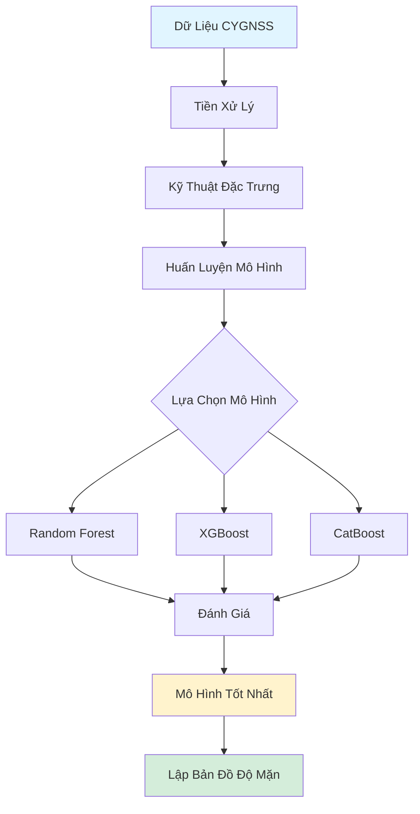

# 🌊 SalinityCygnss

<div align="center">


**Lập Bản Đồ Độ Mặn Đất Sử Dụng Dữ Liệu CYGNSS và Học Máy**

<i>Ứng dụng công nghệ viễn thám và học máy tiên tiến để giám sát độ mặn đất tại Đồng Bằng Sông Cửu Long</i>

[Tổng Quan](#-tổng-quan) •
[Tính Năng](#-tính-năng) •
[Cài Đặt](#-cài-đặt) •
[Hướng Dẫn](#-hướng-dẫn-sử-dụng) •
[Cấu Trúc](#-cấu-trúc-dự-án) •
[Mô Hình](#-các-mô-hình) •
[Trích Dẫn](#-trích-dẫn)

</div>

---

## 📖 Tổng Quan

**SalinityCygnss** là dự án nghiên cứu khai thác dữ liệu vệ tinh **CYGNSS (Cyclone Global Navigation Satellite System)** kết hợp với các thuật toán **Học Máy (Machine Learning)** để lập bản đồ và dự đoán mức độ mặn đất tại khu vực Đồng Bằng Sông Cửu Long (ĐBSCL) Việt Nam.

Kho mã nguồn này chứa bộ dữ liệu, mô hình đã huấn luyện và kết quả phân tích cho nhiều khu vực nghiên cứu qua các năm:

- 🌾 **Đồng Bằng Sông Cửu Long 2025** - Nghiên cứu toàn diện (Mới nhất)
- 🌿 **Trà Vinh 2024** - Phân tích khu vực
- 🏞️ **Bến Tre 2020** - Dữ liệu lịch sử
- 📍 **Bạc Liêu 2019** - Nghiên cứu nền

### Tại Sao Cần Giám Sát Độ Mặn Đất?

Xâm nhập mặn là thách thức nghiêm trọng tại ĐBSCL, ảnh hưởng đến:
- 🌾 Năng suất nông nghiệp
- 💧 Quản lý nguồn nước
- 🌱 Tính bền vững hệ sinh thái
- 👨‍🌾 Sinh kế nông thôn

Phương pháp đo đạc truyền thống tốn thời gian và chi phí. Dự án này chứng minh cách viễn thám vệ tinh kết hợp ML có thể cung cấp:
- ✅ Giám sát quy mô lớn
- ✅ Giải pháp tiết kiệm chi phí
- ✅ Thông tin gần thời gian thực
- ✅ Dự đoán độ phân giải không gian cao

---

## 🔄 Quy Trình Nghiên Cứu


### Các Bước Chính:

1. **Thu Thập Dữ Liệu** 
   - Dữ liệu sổ độ cao (DEM)
   - Dữ liệu khí tượng
   - Dữ liệu CYGNSS
   - Chỉ số viễn thám
   - Dữ liệu thổ nhưỡng

2. **Dữ Liệu Tham Quan Trắc**
   - Số liệu đo mặn thực địa
   - Kiểm chứng trong phòng thí nghiệm

3. **Tiền Xử Lý**
   - Làm sạch dữ liệu
   - Chuẩn hóa
   - Tạo bộ dữ liệu xâm nhập mặn

4. **Mô Hình Hóa Xâm Nhập Mặn**
   - Random Forest (RF)
   - XGBoost
   - CatBoost

5. **Kiểm Định Chéo K-Fold**
   - Đánh giá độ tin cậy mô hình
   - Tránh overfitting

6. **Đánh Giá Hiệu Suất**
   - RMSE (Root Mean Square Error)
   - MAE (Mean Absolute Error)
   - R² (Hệ số xác định)

7. **Đầu Ra Cuối Cùng**
   - Bản đồ xâm nhập mặn
   - Bản đồ phân bố độ mặn
   - Mô hình tốt nhất

---

## ✨ Tính Năng

- 🛰️ **Xử Lý Dữ Liệu CYGNSS** - Xử lý và phân tích dữ liệu vệ tinh GNSS-Reflectometry
- 🤖 **Nhiều Mô Hình ML** - Triển khai và so sánh Random Forest, XGBoost và CatBoost
- 📊 **Phân Tích Toàn Diện** - Độ quan trọng đặc trưng, đánh giá mô hình và trực quan hóa
- 🗺️ **Lập Bản Đồ Không Gian** - Tạo bản đồ độ mặn cho các vùng khác nhau
- 📈 **Chỉ Số Hiệu Suất** - Độ chính xác chi tiết và kết quả kiểm định
- 🔄 **Quy Trình Tái Tạo** - Notebook Jupyter được tổ chức tốt cho từng nghiên cứu

---

## 🚀 Cài Đặt

### Yêu Cầu Hệ Thống

- Python 3.8 trở lên
- Jupyter Notebook / JupyterLab
- Git

### Clone Kho Mã Nguồn

```bash
git clone https://github.com/quanguet0409/SalinityCygnss.git
cd SalinityCygnss
```

### Cài Đặt Thư Viện

```bash
pip install -r requirements.txt
```

**Các thư viện cần thiết:**
- `numpy` - Tính toán số học
- `pandas` - Xử lý dữ liệu
- `scikit-learn` - Thuật toán học máy
- `xgboost` - Gradient boosting
- `catboost` - Gradient boosting trên cây quyết định
- `matplotlib` - Trực quan hóa dữ liệu
- `seaborn` - Vẽ đồ thị thống kê
- `geopandas` - Xử lý dữ liệu không gian địa lý
- `rasterio` - Đọc/ghi dữ liệu raster
- `jupyter` - Notebook tương tác

---

## 📘 Hướng Dẫn Sử Dụng

### 1. Khám Phá Notebooks

Mỗi khu vực nghiên cứu chứa ba notebook mô hình:

```bash
cd Mekong2025/Model
jupyter notebook
```

Các mô hình có sẵn:
- `RF.ipynb` - Mô hình Random Forest
- `XGB.ipynb` - Mô hình XGBoost
- `CB.ipynb` - Mô hình CatBoost

### 2. Chạy Mô Hình

Mở bất kỳ notebook nào và chạy các ô theo thứ tự:

```python
# Quy trình mẫu trong notebook:
1. Nạp dữ liệu
2. Tiền xử lý đặc trưng
3. Huấn luyện mô hình
4. Đánh giá hiệu suất
5. Tạo dự đoán
6. Trực quan hóa kết quả
```

### 3. Xem Kết Quả

Kiểm tra thư mục `Model Results` và `Results` để xem:
- Chỉ số hiệu suất mô hình
- Biểu đồ độ quan trọng đặc trưng
- Bản đồ dự đoán
- Biểu đồ so sánh

---

## 📂 Cấu Trúc Dự Án

```
SalinityCygnss/
│
├── 📁 Mekong2025/              # Nghiên cứu toàn diện mới nhất
│   ├── Data/                   # Bộ dữ liệu đầu vào (91 files)
│   ├── Model/                  # Notebooks mô hình ML
│   │   ├── RF.ipynb           # Random Forest
│   │   ├── XGB.ipynb          # XGBoost
│   │   └── CB.ipynb           # CatBoost
│   ├── Model Results/          # Kết quả mô hình (15 files)
│   ├── Results/                # Dự đoán cuối cùng
│   └── SHP/                    # Shapefiles (vùng ĐBSCL)
│
├── 📁 TraVinh2024/             # Nghiên cứu tỉnh Trà Vinh
│   ├── Data/                   # Dữ liệu khu vực (19 files)
│   └── SHP/                    # Shapefiles tỉnh (8 files)
│
├── 📁 BenTre2020/              # Nghiên cứu tỉnh Bến Tre
│   ├── Data/                   # Dữ liệu lịch sử (19 files)
│   ├── Model/                  # Các mô hình ML
│   └── Results/                # Kết quả phân tích (3 files)
│
├── 📁 BacLieu2019/             # Nghiên cứu nền Bạc Liêu
│
├── 📄 LICENSE                  # Giấy phép MIT
├── 📄 README.md               # File này
└── 📄 flowchart.png           # Sơ đồ quy trình
```

### Cấu Trúc Dữ Liệu

Mỗi thư mục nghiên cứu chứa:
- **Data/** - Dữ liệu CYGNSS đã xử lý và đặc trưng phụ
- **Model/** - Jupyter notebooks để huấn luyện mô hình
- **Results/** - Kết quả dự đoán và trực quan hóa
- **SHP/** - Shapefiles ranh giới địa lý

---

## 🤖 Các Mô Hình

Dự án triển khai ba thuật toán học tập tổng hợp hiện đại:

### 1. **Random Forest (RF)**
- Tổng hợp nhiều cây quyết định
- Kháng overfitting tốt
- Xử lý mối quan hệ phi tuyến
- Cung cấp độ quan trọng đặc trưng

### 2. **XGBoost (XGB)**
- Framework gradient boosting
- Hiệu suất và tốc độ cao
- Điều chuẩn để tránh overfitting
- Xử lý giá trị thiếu

### 3. **CatBoost (CB)**
- Gradient boosting trên cây quyết định
- Xử lý đặc trưng phân loại vượt trội
- Hỗ trợ GPU tích hợp
- Giảm thời gian dự đoán

### So Sánh Mô Hình

Mỗi mô hình được đánh giá bằng:
- **R² Score** - Hệ số xác định
- **RMSE** - Sai số bình phương trung bình gốc
- **MAE** - Sai số tuyệt đối trung bình
- **Cross-validation** - Kiểm định chéo K-fold

---

## 📊 Kết Quả

Kết quả bao gồm:
- ✅ Trọng số mô hình đã huấn luyện
- ✅ So sánh chỉ số hiệu suất
- ✅ Xếp hạng độ quan trọng đặc trưng
- ✅ Bản đồ dự đoán không gian
- ✅ Biểu đồ phân tán kiểm định
- ✅ Phân tích phần dư

*Kết quả chi tiết có sẵn trong thư mục `Results/` và `Model Results/` của từng nghiên cứu.*

---

## 🔬 Phương Pháp Luận



---

## 🗺️ Khu Vực Nghiên Cứu

### Đồng Bằng Sông Cửu Long (ĐBSCL)
ĐBSCL Việt Nam là một trong những vùng nông nghiệp sản xuất lớn nhất thế giới nhưng đang đối mặt với xâm nhập mặn gia tăng do:
- 🌊 Mực nước biển dâng
- 💧 Lượng nước ngọt giảm
- 🌡️ Tác động biến đổi khí hậu

Các mô hình của chúng tôi giúp giám sát và dự đoán các mô hình độ mặn để hỗ trợ:
- 🌾 Quy hoạch cây trồng
- 💧 Quản lý nguồn nước
- 📋 Quyết định chính sách

---

## 🔧 Nguồn Dữ Liệu

- **Dữ Liệu CYGNSS**: NASA CYGNSS Level 1 Science Data Record
- **Dữ Liệu Thực Địa**: Đo đạc hiện trường từ các khu vực nghiên cứu
- **Dữ Liệu Phụ Trợ**: 
  - Mô hình số độ cao (DEM)
  - Sử dụng đất/lớp phủ
  - Tính chất đất
  - Biến khí hậu

---

## 📈 Công Việc Tương Lai

- [ ] Hệ thống dự đoán thời gian thực
- [ ] Dashboard trực quan hóa trên web
- [ ] Tích hợp thêm nguồn dữ liệu vệ tinh
- [ ] Triển khai mô hình deep learning
- [ ] Pipeline dữ liệu tự động
- [ ] API cho dự đoán độ mặn

---

## 🤝 Đóng Góp

Chúng tôi hoan nghênh mọi đóng góp! Vui lòng tạo Pull Request.

1. Fork repository
2. Tạo nhánh tính năng (`git checkout -b feature/TinhNangMoi`)
3. Commit thay đổi (`git commit -m 'Thêm tính năng mới'`)
4. Push lên nhánh (`git push origin feature/TinhNangMoi`)
5. Mở Pull Request

---

## 📄 Giấy Phép

Dự án này được cấp phép theo Giấy phép MIT - xem file [LICENSE](LICENSE) để biết chi tiết.

---

## 📧 Liên Hệ

**Tác Giả**: [Tên của bạn]  
**Email**: [email@example.com]  
**Tổ Chức**: [Trường/Tổ chức của bạn]

**Link Dự Án**: [https://github.com/quanguet0409/SalinityCygnss](https://github.com/quanguet0409/SalinityCygnss)

---

## 🙏 Lời Cảm Ơn

- NASA CYGNSS mission đã cung cấp dữ liệu vệ tinh
- [Tổ chức/nguồn tài trợ của bạn]
- Các cộng tác viên và đội ngũ thực địa
- Cộng đồng mã nguồn mở

---

## 📚 Trích Dẫn

Nếu bạn sử dụng công trình này trong nghiên cứu, vui lòng trích dẫn:

```bibtex
@software{SalinityCygnss2025,
  author = {Tên Của Bạn},
  title = {SalinityCygnss: Lập Bản Đồ Độ Mặn Đất Sử Dụng Dữ Liệu CYGNSS và Học Máy},
  year = {2025},
  publisher = {GitHub},
  url = {https://github.com/quanguet0409/SalinityCygnss}
}
```

---

<div align="center">

**⭐ Nếu bạn thấy dự án này hữu ích, hãy cho một ngôi sao! ⭐**

Được tạo với ❤️ vì nông nghiệp bền vững tại Đồng Bằng Sông Cửu Long

</div>